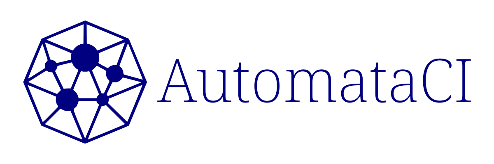

# AutomataCI
[](#automataci)

This is a template git repository equipped with a native built-in
semi-autonomous CI tool known as `AutomataCI`. It allows one to run a full-force
CI jobs without solely relying on any 3rd-party service providers which makes
the project extremely vulenrable to supply chain threat at least starting from
year 2021-2023 era.


## Why It Matters

Some good business reasons why using AutomataCI:

1. **Starts off with a solid & tested foundation** - All the templates and
   CI jobs are tested and have default configured for immediate software
   development.
2. **Avoid being threatend by malicious suppliers** - CI it's a nerve system for
   your product; handle it in-house and natively rather than leaving it nakedly
   vulnerable for any kind 3rd-party extortions.
3. **Steadily improvable** - AutomataCI itself are designed to be adaptive to
   market changes, self-improvable, and cater to common use cases.
4. **Simple and scalable** - Only uses `POSIX` shell and `PowerShell` so it
   works natively without much external installation.


### Supported Technologies

* C Programming Language
  1. [i386 & amd64 GCC Compilers](https://gcc.gnu.org/)
  2. [ARM (-64, -el, -hf) Cross-Compilers](https://wiki.debian.org/CrossToolchains)
  3. [MIPS (-64 -64el, -64r6, -64r6el, -el, -r6, -r6el) Cross-Compilers](https://wiki.debian.org/CrossToolchains)
  4. [RISCV Cross-Compiler](https://github.com/riscv-software-src/homebrew-riscv)
  5. [S390X Cross-Compiler](https://github.com/riscv-software-src/homebrew-riscv)
  6. [PowerPC & ppc64el Cross-Compilers](https://wiki.debian.org/CrossToolchains)
  7. [AVR Cross-Compiler](https://tldp.org/HOWTO/Avr-Microcontrollers-in-Linux-Howto/x207.html)
  8. [Clang](https://clang.llvm.org/)
  9. [MinGW](https://www.mingw-w64.org/)
  10. [Emscripten WASM](https://emscripten.org/)
* [Go Programming Language](https://go.dev/)
* Javascript & Typescript Web Frameworks
  1. [Angular](https://angular.io/)
* [Nim Programming Language](https://nim-lang.org/)
* [Python Programming Language](https://www.python.org/)
* [Rust Programming Language](https://www.rust-lang.org/)
* Some Manual MISC stuffs


### Deployable Distributions

* [`cargo` repo](https://crates.io/) (for `cargo install` capability)
* [`.deb` repo](https://wiki.debian.org/DebianRepository/Setup) (with `apt-get install` capability)
* [`.opkg` repo](https://git.yoctoproject.org/opkg/) (with `opkg install` capability - *COMING SOON?!*)
* [`.rpm` repo](https://access.redhat.com/documentation/en-us/red_hat_enterprise_linux/8/html-single/packaging_and_distributing_software/index) (with `yum install` capability)
* [`.flatpak` repo](https://docs.flatpak.org/en/latest/first-build.html) (for `flatpak install` capability)
* [`OCI` compatible containers](https://docs.github.com/en/packages/working-with-a-github-packages-registry/working-with-the-container-registry) (for `docker run` or `podman run` capability)
* [`PyPi` repo](https://pypi.org/) (for `pip install` capability)
* Static Sites ([GitHub Pages](https://pages.github.com/),
  [Cloudflare Pages](https://pages.cloudflare.com/))
* [`Homebrew` ecosystem](https://brew.sh/) (for `brew install` capability)
* [`Chocolatey` ecosystem](https://chocolatey.org/) (for `choco install` capability)
* GitHub Security Advisory (for CVE management)


### 3rd-Party CI Integrations

AutomataCI works seamlessly out of the box by integration with:

1. [GitHub Actions](https://docs.github.com/en/actions)
2. [GitLab CI](https://docs.gitlab.com/ee/ci/) (*COMING SOON*)


### Documentations & Specifications

Check out the PDF file inside
[`automataCI/docs/AutomataCI-Engineering-Specification.pdf`](automataCI/docs/AutomataCI-Engineering-Specification.pdf).

It's regularly updated from time-to-time between each releases.


## How To Use AutomataCI

The entire Git repository is a actually a template repository. Hence, you would
either have to `git clone` it or download a copy of the latest source codes from
the [Release](https://github.com/ChewKeanHo/AutomataCI/releases) section. Then,
execute the following steps to make sure everything is correct.


### Refresh The Git Hooks

Once unpacked, you will need to refresh the `git` hooks by deleting the hidden
`.git` directory at the root of the repository and then git init again. A POSIX
Shell command looks as follow:

```
$ rm -rf .git
$ git init --initial-branch=main
$ git remote add origin <YOUR REMOTE URL>
```


### Update Software License

By default, the presented product license (`LICENSE.txt`) is using the
AutomataCI license. The goal is to change and update it matching to your product
license.

You should also update all files inside `src/licenses` matching your own
project. The `src/licenses/LICENSE-EN.odt` file is a
[LibreOffice](https://www.libreoffice.org/) Writer file. Hence, you're free to
use other document generator product as long as it can produce
`src/licenses/LICENSE-EN.pdf` for later packaging distribution use.


### Update Logo

By default, the presented icons and banners are of AutomataCI inside
`src/icons/` directory generated from the materials in
`src/icons/principle-canvas` using [Inkscape](https://inkscape.org/)
design software. You're free to use other design software as long as it can
generate the required output artifacts.

Once you're done designing your product brand in `src/icons/principle-canvas`
directory, please generate an optimized and usable graphic artifacts as follow:

1. `src/icons/icon.svg` - generic and widely-compatible icon file used
   everywhere.
2. `src/icons/icon-48x48.png` - PNG 48x48 icon file used in Linux system's
   icon and shortcuts.
3. `src/icons/icon-128x128.png` - PNG 48x48 icon file used in Linux system's
   icon and shortcuts.
4. `src/icons/icon-1200x400.svg` - used in README.md or marketing promotion.


### Update `CODE_OF_CONDUCT.md`

If required, please update `CODE_OF_CONDUCT.md` with your appropriate legal
clauses.


### Update `CONFIG.toml`

By default, AutomataCI is deploying its own `CONFIG.toml` product data. You
should update it entirely matching your product.

#### Technological Selections

AutomataCI is capable of running multiple supported technologies in a
repository. For example, you can enable Python technology by defining the
`PROJECT_PYTHON` directory name (default is `srcPYTHON`) and Go technology by
defining the `PROJECT_GO` directory name (default is `srcGO`) at the same time.

Choose wisely as the multiple tech feature consideration was made solely for
those who wants to use dedicated tech for other purposes (e.g. `SCULLY` for
static documents generation).


### Update Selected Tech's CI Specific Job Recipes

The default source codes directory (`src[TECH]`) comes with their tech-specific
AutomataCI job recipes inside its `src[TECH]/.ci` directory. Feel free to
modify them matching your needs using your POSIX Shell and PowerShell knowledge.


### Update All Distribution Resource files

All the data resource files in `src/{docs,packages,publishers}` shall be
updated matching to your product needs. Their specifications are made available
in the `automataCI/AutomataCI-Engineering-Specification.pdf` documentation.


### Update GitHub Integration Configurations

While usually not required, you can update the GitHub integration files inside
`.github` directory. Notable files are:

1. `.github/ISSUE_TEMPLATES/*` - issue templates.
2. `.github/PULL_REQUEST_TEMPLATE/*` - pull request template.
3. `.github/workflows/*` - GitHub Actions workflow recipes.
4. `.github/FUNDING.yml` - GitHub Sponsor button (Refer [Spec](https://docs.github.com/en/repositories/managing-your-repositorys-settings-and-features/customizing-your-repository/displaying-a-sponsor-button-in-your-repository)).


### Update README.md

Lastly, please update this `README.md` file. Currently, it's written for
AutomataCI project. You can remove it and write a new one.


### Clean Up Unused Source Directories

AutomataCI supplied a large number of source directories by tech. Once you had
decided your tech, you may remove all the unused source directories
(`src[TECH]`) and clean up the repository.


### Git Commit Initial Setup

At this point, your repo is now ready. Feel free to git commit your
initialization (assuming you're using `main` as primary branch):

```
$ git add .
$ git commit -s
... WRITE YOUR COMMIT ...
$ git push -u origin main:main
$ git switch --orphan gh-pages
$ git commit --allow-empty -m "Initial Commit"
$ git push origin gh-pages:gh-pages
$ git checkout main
```


## Operating AutomataCI

To operate AutomataCI, simply execute the `ci.cmd` help section:

```
$ ./ci.cmd help

Please try any of the following:
        To seek commands' help 🠚        $ ./ci.cmd help
        To initialize environment 🠚     $ ./ci.cmd env
        To setup the repo for work 🠚    $ ./ci.cmd setup
        To prepare the repo 🠚           $ ./ci.cmd prepare
        To start a development 🠚        $ ./ci.cmd start
        To test the repo 🠚              $ ./ci.cmd test
        Like build but only for host 🠚  $ ./ci.cmd materialize
        To build the repo 🠚             $ ./ci.cmd build
        To notarize the builds 🠚        $ ./ci.cmd notarize
        To package the repo product 🠚   $ ./ci.cmd package
        To release the repo product 🠚   $ ./ci.cmd release
        To stop a development 🠚         $ ./ci.cmd stop
        To clean the workspace 🠚        $ ./ci.cmd clean
        To purge everything 🠚           $ ./ci.cmd purge
```

The CI jobs are arranged in a storyline manner from top to bottom. Feel free
to execute accordingly.


## To Contribute

AutomataCI cannot be made successfully without contributions from (Holloway)
Chew, Kean Ho and supports from external folks. If you had been using AutomataCI
and wish to contribute back, there are 2 ways to do so:


### Financial

To financially support the project, please head over to Holloway's sponorship
store here:

[](https://github.com/sponsors/hollowaykeanho)

A small token purchase would helps a lot.


### Craftmanship

If you wish to bring in codes contribution, bug report, and ideas, please feel
free to refer the PDF engineering spec located in the `automataCI/` directory.


## License
AutomataCI is licensed under OSI compatible [Apache 2.0 License](LICENSE.txt)
