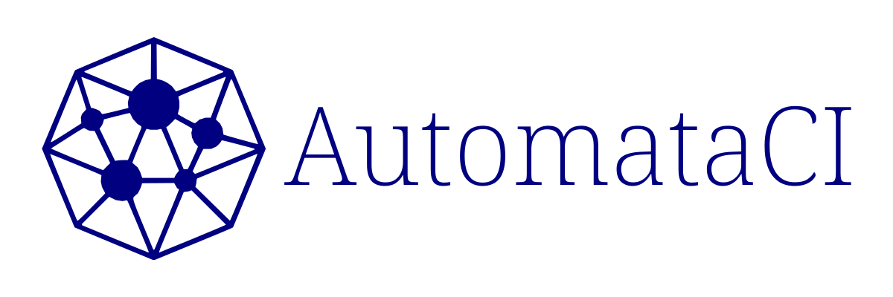

# AutomataCI

This repo is a project template repository equipped with the AutomataCI serving
as a development foundation for software production of the supported kinds. The
development was started since 2022 under the
[ZORALab's Monteur](https://github.com/zoralab/monteur) Project to secure a
software production from the imminent supply chain threat across the software
industry globally.

## Why It Matters
Some good reasons to use AutomataCI:

1. **Start off with a tested foundation with pinpoint accuracy** - don't have to
   start from scratch anymore and just focus on your product development.
2. **Steadily for continuous improvement** - version controlled and improve
   iteratively.
3. **Simple and scalable** - just one git and some changes; you get a decent
   repo ready to deploy.
4. **Nimble and Adaptable** - don't let your suppliers' dirty business tricks
   threatens you.

> ## How to Use
>
> **IMPORTANT: REMEMBER TO REMOVE THIS SECTION AFTER COMPLETION.**
>
> 1. Git clone and re-init or click the "Use This Template" button on GitHub.
> 2. Update all the files in `resources` directories and regenerate the
>    `resources/logos/logo.svg`, `resources/logos/logo-48x48.png`,
>    `resources/logos/logo-128x128.png`, `DEVELOPER_GUIDES_[LANG].pdf`, and
>    `USER_GUIDES_[LANG].pdf`.
> 3. Generate and update the LICENSE file(s).
> 4. `[OPTIONAL]` - Add a `CODE_OF_CONDUCT.md` file with the appropriate legal
>    clauses(s).
> 5. Update the `CONFIG.toml` matching your project metadata.
> 6. Select your tech (e.g. `srcGO` for Go or `srcPYTHON` for python) by
>    updating the `PROJECT_PATH_SOURCE` in `CONFIG.toml` to target it. Remove
>    all unused placeholders.
> 7. `[OPTIONAL]` - Update your `src[TECH]/.ci` job recipes matching your
>    project needs.
> 8. Update the README.md with your Project's metadata.
> 9. Delete this blockquote once everything is done.

## To Contribute
For all contributors, please refer to the `DEVELOPER-GUIDES-[LANG].pdf` to
before starting anything. The guide contains all the required instructions,
knowledge, specifications, and guidelines for operating the repository.

## License
This project is licensed under multiple licenses:

1. Main license - [??? License](LICENSE)
