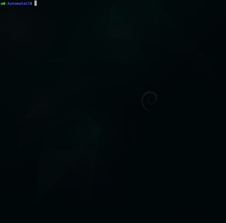

# AutomataCI

A multi-purpose Git template repository with built-in natively operable
semi-autonomous CI infrastructure.

***Run all full-force CI anywhere without solely depending on any 3rd-party
provider***.

## Why It Matters

Some good business reasons why using AutomataCI:

1. **Starts off with a solid & tested foundation** - All templates and CI
   jobs are thoroughly tested and equipped with proper default configurations for
   immediate development.
3. **Avoid being threatend by malicious suppliers** - CI it's a nerve system for
   your product; handle it in-house and natively rather than leaving it nakedly
   vulnerable for any kind of 3rd-party mercenaric extortions.
4. **Steadily improvable** - AutomataCI itself are designed to be continuously
   adaptive to market changes, self-improvable, and cater to common use cases.
6. **Simple and scalable** - Built completely using only `POSIX` Shell and
   `Power` Shell so it works natively without additional installations.

### Cross-compile Confidently

Build confidently not just for common CPU but other hardware as well with your
selected technologies.

### Maximizes Reaches

Packaging your software to many standard distribution channels for maximizing
customer reaches.

### Focusing Business Objectives

Deploy multiple technologies for your product via multiple technological
integrations (within sensible requirements of course).

### Securing Point of Origin

Crypographically sign the packages alongside shasum checking - for all security
level needs; whenever, wherever.

### Container Ready

Small-sized Open-Source Image Container (docker / podman) with cross-platform
images are available whenever possible.

## Supported Technologies

* C Programming Language
  1. [i386 & amd64 GCC Compilers](https://gcc.gnu.org/)
  2. [ARM (-64, -el, -hf) Cross-Compilers](https://wiki.debian.org/CrossToolchains)
  3. [MIPS (-64 -64el, -64r6, -64r6el, -el, -r6, -r6el) Cross-Compilers](https://wiki.debian.org/CrossToolchains)
  4. [RISCV Cross-Compiler](https://github.com/riscv-software-src/homebrew-riscv)
  5. [S390X Cross-Compiler](https://github.com/riscv-software-src/homebrew-riscv)
  6. [PowerPC & ppc64el Cross-Compilers](https://wiki.debian.org/CrossToolchains)
  7. [AVR Cross-Compiler](https://tldp.org/HOWTO/Avr-Microcontrollers-in-Linux-Howto/x207.html)
  8. [Clang](https://clang.llvm.org/)
  9. [MinGW](https://www.mingw-w64.org/)
  10. [Emscripten WASM](https://emscripten.org/)
* Go
  1. [Standard Go](https://go.dev/)
* Javascript & Typescript Web Frameworks
  1. [Angular](https://angular.io/)
* [Nim Programming Language](https://nim-lang.org/)
* [Python Programming Language](https://www.python.org/)
* [Rust Programming Language](https://www.rust-lang.org/)
* Some Manual MISC stuffs

### Deployable Distributions

* Microsoft Windows Ecosystems
  1. [`Chocolatey` ecosystem](https://chocolatey.org/) (for `choco install` capability)
  2. [`MSI` packages](https://wixtoolset.org/) (for conventional installation)
  3. [`WinGet` repo](https://learn.microsoft.com/en-us/windows/package-manager/winget/) (for `winget install` capability - COMING SOON)
* Fleet Deployments
  1. [`OCI` compatible containers](https://docs.github.com/en/packages/working-with-a-github-packages-registry/working-with-the-container-registry) (for `docker run` or `podman run` capability)
  2. [`PyPi` repo](https://pypi.org/) (for `pip install` capability)
  3. [`cargo` repo](https://crates.io/) (for `cargo install` capability)
* UNIX Ecosystems (Linux & BSD)
  1. [`.deb` repo](https://wiki.debian.org/DebianRepository/Setup) (with `apt-get install` capability)
  2. [`.flatpak` repo](https://docs.flatpak.org/en/latest/first-build.html) (for `flatpak install` capability)
  3. [`Homebrew` ecosystem](https://brew.sh/) (for `brew install` capability)
  4. [`.opkg` repo](https://git.yoctoproject.org/opkg/) (with `opkg install` capability - *COMING SOON?!*)
  5. [`.rpm` repo](https://access.redhat.com/documentation/en-us/red_hat_enterprise_linux/8/html-single/packaging_and_distributing_software/index) (with `yum install` capability)
* Security
  1. GitHub Security Advisory (for CVE management)
* Static Website
  1. [Cloudflare Pages](https://pages.cloudflare.com/)
  2. [GitHub Pages](https://pages.github.com/)

### 3rd-Party CI Integrations

AutomataCI works seamlessly out of the box by integration with:

1. [GitHub Actions](https://docs.github.com/en/actions)
2. [GitLab CI](https://docs.gitlab.com/ee/ci/) (*COMING SOON*)

## How-tos, Documentations & Specifications
Well, the instructions are available as a PDF Handbooks in case of offline
needs. Please take your time and download a copy:

* [International English](.internals/docs/automataci-user-guide_en.pdf)

## To Contribute

AutomataCI cannot be made successfully without contributions from (Holloway)
Chew, Kean Ho and supports from external folks. If you had been using AutomataCI
and wish to contribute back, there are 2 ways to do so:

### Financial

To financially support the project, please head over to Holloway's sponorship
store here:

A small token purchase would helps a lot.

### Craftmanship

If you wish to bring in codes contribution, bug report, and ideas, please feel
free to refer the PDF engineering spec located in the `automataCI/` directory.

## License
AutomataCI is licensed under OSI compatible [Apache 2.0 License](LICENSE.txt)
